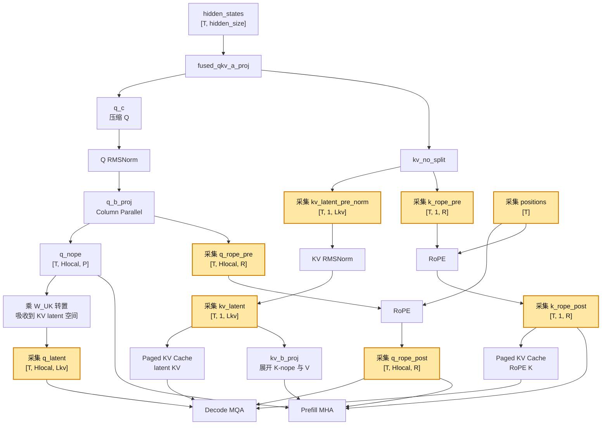
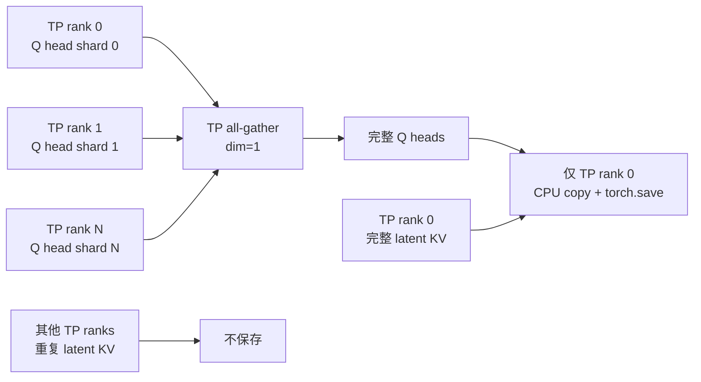

# MLA 计算流、采集点与 TP 聚合

## 计算流

黄色节点表示当前已经保存的数据。



## TP 中哪些数据会切分

MLA 的 Q projection 是 Column Parallel，Q heads 按 TP rank 切分：

```text
Hlocal = Htotal / TP
```

因此 `q_latent`、`q_rope_pre` 和 `q_rope_post` 在单卡上都只包含本地 Q head 分片，需要沿 head 维 `dim=1` 做 all-gather。

MLA 使用单个压缩 KV head，`W_DKV`/fused A projection 不进行 TP 切分。因此以下数据在纯 TP 模式下每张卡都有完整副本：

- `kv_latent_pre_norm`
- `kv_latent`
- `k_rope_pre`
- `k_rope_post`
- `positions`

它们不能沿 head 维拼接，否则会错误地得到 TP 份重复 KV。

## rank-0 保存流程



`all_gather` 的结果会短暂存在于所有 TP rank 的设备内存中，这是 all-gather collective 的语义；但只有 TP rank 0 会将结果复制到 CPU 并落盘。

## 典型模型示例

| 模型 | 全局 Q heads | TP | 每卡 Q heads | 每卡 latent KV heads |
| --- | ---: | ---: | ---: | ---: |
| DeepSeek V3.1 | 128 | 8 | 16 | 1 个完整副本 |
| LongCat-Flash | 64 | 8 | 8 | 1 个完整副本 |

因此离线分析时不需要再读取和拼接其他 TP rank 的文件；rank 0 文件已经包含完整 Q 和一份不重复的 latent KV。
