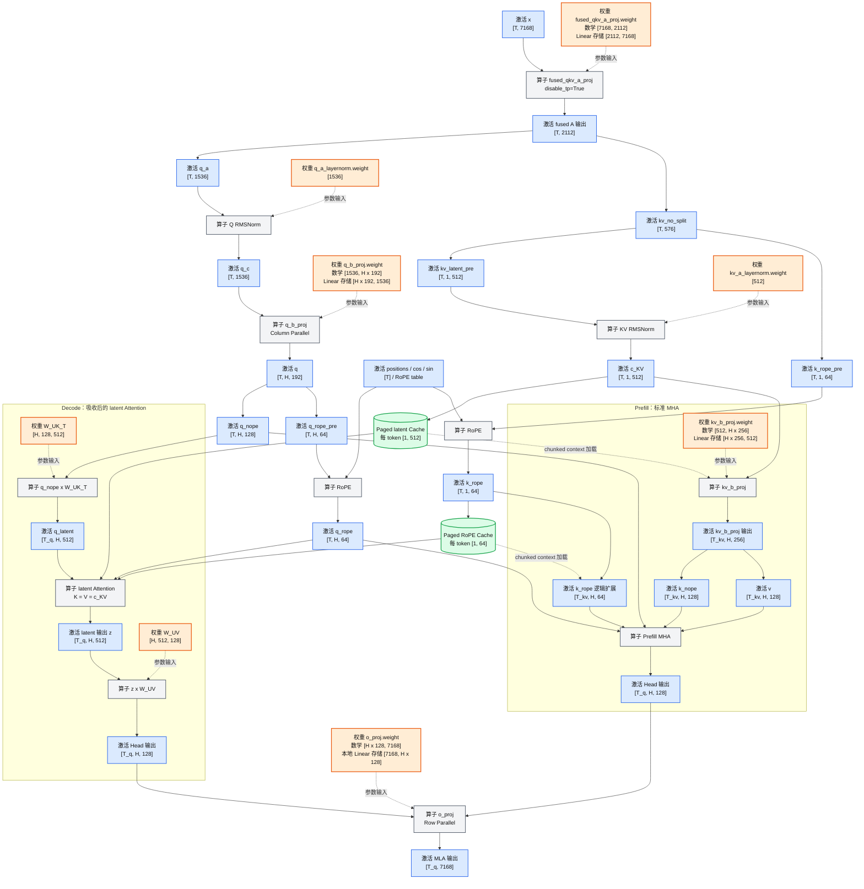

# MLA 架构

本文以 DeepSeek-V3.1 的 MLA 参数为例，说明数学结构以及 vLLM Ascend 中
prefill、decode 和 TP 并行时的实际数据流。

## 1. 参数和符号

| 符号 | 配置 | 全局值 |
|---|---|---:|
| $D_h$ | `hidden_size` | 7168 |
| $N_h$ | `num_attention_heads` | 128 |
| $L_q$ | `q_lora_rank` | 1536 |
| $L_c$ | `kv_lora_rank` | 512 |
| $P$ | `qk_nope_head_dim` | 128 |
| $R$ | `qk_rope_head_dim` | 64 |
| $D_q=P+R$ | Q/K head dim | 192 |
| $V$ | `v_head_dim` | 128 |
| $L_{kv}=L_c+R$ | KV 下投影输出维度 | 576 |

在 TP 并行下，记当前 rank 的本地 Query Head 数为：

$$
H = \frac{N_h}{TP}.
$$

例如 TP=8 时，$H=16$。下文运行时张量使用 $H$ 表示本地 Head 数；如果只讨论
未切分的全局数学形式，可以把 $H$ 替换为 $N_h=128$。

## 2. KV Cache 中实际保存的张量

KV 下投影首先产生未归一化的 latent 和未旋转的 RoPE Key：

$$
\begin{aligned}
l_{kv} &= xW_{DKV}, && l_{kv}\in\mathbb{R}^{T\times(L_c+R)},\\
l_c^{pre},\ k_R^{pre} &= \operatorname{split}(l_{kv},[L_c,R]).
\end{aligned}
$$

随后执行 RMSNorm 和 RoPE：

$$
\begin{aligned}
c^{KV} &= \operatorname{RMSNorm}(l_c^{pre}),
    &&c^{KV}\in\mathbb{R}^{T\times1\times512},\\
k^R &= \operatorname{RoPE}(k_R^{pre}),
    &&k^R\in\mathbb{R}^{T\times1\times64}.
\end{aligned}
$$

Paged KV Cache 每层、每个 token 保存的是：

$$
\operatorname{cache}_t=[c_t^{KV},k_t^R],
$$

即 $512+64=576$ 个元素。这里的 $c^{KV}$ 是 RMSNorm 后的 latent，$k^R$ 是
RoPE 后的 Key。两者都只有一个 KV Head，在标准 TP（不考虑 CP/DCP）下会在各个
TP rank 上重复保存。

当前 Paged Cache 分配时，两部分的语义布局分别是：

$$
\begin{aligned}
\text{latent cache} &: [N_{block},B_{block},1,L_c],\\
\text{RoPE cache} &: [N_{block},B_{block},1,R].
\end{aligned}
$$

具体 Kernel 调用前可能调整维度顺序，但不会改变“单 KV Head、512 维 latent 加
64 维 RoPE”的语义。

## 3. 权重

以下 shape 采用行向量右乘的数学约定，列出的是全局概念形状。PyTorch
`Linear` 的物理存储通常是 `[out_features, in_features]`，且带 Head 维的权重在
TP 下只保存本地 $H$ 个 Head。

| 权重 | 作用 | 全局概念 shape |
|---|---|---:|
| $W_{DQ}$ | Query 下投影 | $(D_h,L_q)=(7168,1536)$ |
| $W_{UQ}$ | Query 上投影 | $(N_h,L_q,D_q)=(128,1536,192)$ |
| $W_{DKV}$ | KV 下投影 | $(D_h,L_c+R)=(7168,576)$ |
| $W_{UK}$ | latent K 上投影 | $(N_h,L_c,P)=(128,512,128)$ |
| $W_{UV}$ | latent V 上投影 | $(N_h,L_c,V)=(128,512,128)$ |
| $W_O$ | Attention 输出投影 | $(N_hV,D_h)=(16384,7168)$ |

在当前 vLLM MLA 实现中，$W_{DQ}$ 和 $W_{DKV}$ 合并为
`fused_qkv_a_proj`，其输出维度为：

$$
L_q+L_c+R=1536+512+64=2112.
$$

## 4. 总体数据流

下图严格区分四类节点：

- **权重**：模型参数，节点中标注权重 shape；
- **算子**：执行投影、归一化、RoPE 或 Attention，不给算子本身标注张量 shape；
- **激活**：运行时张量，节点中所有 `[T,...]` 都是激活 shape；
- **Cache**：跨 step 保存的 Paged KV Cache。

`fused_qkv_a_proj` 严格来说是一个 Linear 层/投影算子，真正的权重参数是
`fused_qkv_a_proj.weight`。它的权重 shape 和算子输出的激活 shape 分开标注如下：

图中的 $T$ 是当前投影输入的 token 数，$T_q$ 是当前 Query token 数，$T_{kv}$ 是
本次 Attention 使用的 KV token 数。Prefill 时，$T_q$ 和 $T_{kv}$ 可以不同；
decode 通常有很短的 $T_q$，但会读取较长的历史 Cache。

## 5. Prefill：展开为标准 MHA

设当前 rank 的输入为 $x\in\mathbb{R}^{T\times D_h}$。

### 5.1 Query 路径

$$
\begin{aligned}
q_c &= \operatorname{RMSNorm}(xW_{DQ}),
    &&q_c\in\mathbb{R}^{T\times L_q},\\
q &= q_cW_{UQ},
    &&q\in\mathbb{R}^{T\times H\times(P+R)},\\
q^N,\ q_R^{pre} &= \operatorname{split}(q,[P,R]),\\
q^N &\in\mathbb{R}^{T\times H\times128},\\
q^R &= \operatorname{RoPE}(q_R^{pre}),
    &&q^R\in\mathbb{R}^{T\times H\times64}.
\end{aligned}
$$

### 5.2 KV 路径

首先按照第 2 节得到并缓存 $c^{KV}$ 和 $k^R$，再把归一化后的 latent 上投影：

$$
\begin{aligned}
k_i^N &= c^{KV}W_{UK}^{i},
    &&k_i^N\in\mathbb{R}^{T\times P},\\
v_i &= c^{KV}W_{UV}^{i},
    &&v_i\in\mathbb{R}^{T\times V}.
\end{aligned}
$$

合并所有本地 Head 后：

$$
k^N\in\mathbb{R}^{T\times H\times128},\qquad
v\in\mathbb{R}^{T\times H\times128}.
$$

$k^R$ 的原始 shape 始终是 $[T,1,64]$。在标准 prefill Attention 前，它只做
逻辑扩展，得到 $[T,H,64]$，并不产生 $H$ 份独立数据。

### 5.3 Attention

对本地第 $i$ 个 Head：

$$
\begin{aligned}
S_i &= \left(q_i^N(k_i^N)^T+q_i^R(k^R)^T\right)\cdot\operatorname{scale},\\
P_i &= \operatorname{softmax}(S_i),\\
A_i &= P_iv_i.
\end{aligned}
$$

其中 Nope 部分是 MHA，不同 Head 使用各自的 $k_i^N$；RoPE Key 是 MQA，所有
Query Head 共享同一个 $k^R$。本地 Head 输出拼接后经过 Row-Parallel 的 $W_O$：

$$
O=\operatorname{Concat}\{A_i\}_{i=1}^{N_h}W_O.
$$

上式是全局数学形式；TP 实现中，每个 rank 只计算本地 $H$ 个 Head，随后由
Row-Parallel 输出投影完成跨 rank 归约。

## 6. Decode：权重吸收后的 latent Attention

Decode 不需要把历史 $c^{KV}$ 展开成每个 Head 的完整 $k^N$ 和 $v$。对于第 $i$ 个
Head，有：

$$
\begin{aligned}
q_i^N(k_i^N)^T
&=q_i^N(c^{KV}W_{UK}^{i})^T\\
&=(q_i^N(W_{UK}^{i})^T)(c^{KV})^T,\\
P_iv_i
&=P_i(c^{KV}W_{UV}^{i})\\
&=(P_ic^{KV})W_{UV}^{i}.
\end{aligned}
$$

因此先把 $W_{UK}$ 吸收到 Query：

$$
q_i^L=q_i^N(W_{UK}^{i})^T,
\qquad q_i^L\in\mathbb{R}^{T\times L_c},
$$

再直接在 latent 空间计算：

$$
\begin{aligned}
S_i &= \left(q_i^L(c^{KV})^T+q_i^R(k^R)^T\right)
       \cdot\operatorname{scale},\\
P_i &= \operatorname{softmax}(S_i),\\
z_i &= P_ic^{KV},\\
A_i &= z_iW_{UV}^{i}.
\end{aligned}
$$

vLLM Ascend 的 decode Attention 算子中，$c^{KV}$ 同时作为 latent K 和 latent V，
Attention 输出后再通过 $W_{UV}$ 恢复到每个 Head 的 $V=128$ 维。

这里避免的是把历史 $c^{KV}$ 逐 Head 上投影为 $k^N$ 和 $v$。

## 7. vLLM Ascend 中的实际实现和 TP 行为

### 7.1 TP 切分

- `fused_qkv_a_proj` 没有 Head 输出维度切分，使用 `disable_tp=True`，因此
  $W_{DQ}$、$W_{DKV}$ 的权重和 $[T,2112]$ 输出维度都不做 TP 切分。在普通 TP
  输入相同的情况下，各 rank 得到相同的融合输出。
- `q_b_proj`、`kv_b_proj` 按 Head 切分，每个 rank 计算 $H=N_h/TP$ 个 Head。
- $W_{UK}$、$W_{UV}$ 在加载后按本地 Head 重排为吸收计算所需的形状。
- `o_proj` 是 Row-Parallel，负责聚合各 rank 的本地 Head 输出。
- 普通 TP 下的 $c^{KV}$ 和 $k^R$ Cache 在各 rank 重复保存。CP、DCP 或其他
  Sequence/Context Parallel 模式需要单独分析，不能直接套用这一结论。

### 7.2 Prefill 和 chunked context

当前 vLLM Ascend 的经典 MLA 路径中：

1. 新进入 prefill 的 token 先计算并缓存 $c^{KV}$ 和 $k^R$；
2. 当前 token 的 $c^{KV}$ 经过 `kv_b_proj`，展开为本地 Head 的 $k^N$ 和 $v$；
3. Prefix Cache 命中或 Chunked Prefill 存在历史上下文时，后端按照本次请求的
   上下文范围和 workspace 大小，分块加载历史 $c^{KV}$；
4. 每个被加载的历史块都会再次经过 `kv_b_proj`，然后执行标准 MHA；
5. 各历史块的 partial output 和 LSE 最后通过 online-softmax 规则合并。

因此，Chunked Prefill 确实会重复上投影本次请求所引用的历史 latent，但并不是把
整个系统中的所有 KV Cache 一次性加载和展开。

Prefill 选择标准 MHA 的主要原因是计算量权衡。忽略常数和 Kernel 差异时，每个
Query-Key 对的主要内积维度为：

$$
\begin{aligned}
\text{标准 MHA} &: (P+R)+V=128+64+128=320,\\
\text{latent Attention} &: (L_c+R)+L_c=512+64+512=1088.
\end{aligned}
$$

Prefill 的 Query 长度较大，直接在 512 维 latent 空间做 QK 和 PV 会显著增加
Attention 主体计算量，所以先支付一次 `kv_b_proj` 上投影，再使用较小 Head 维度的
标准 MHA 通常更合适。Decode 的 Query 很短，系统更容易受历史 KV Cache 读取和逐
Head 展开开销限制，因此采用吸收后的 latent Attention。
