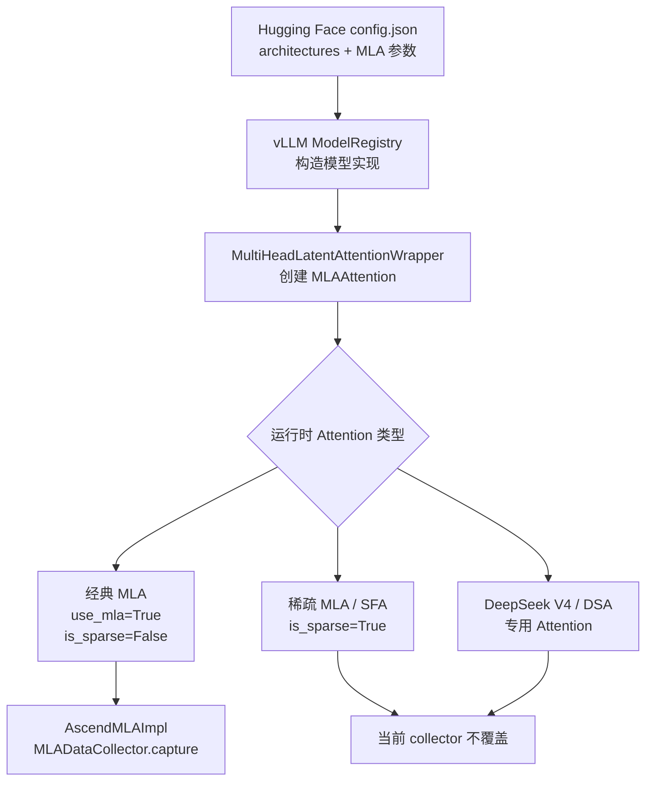

# MLA 相关模型兼容性

本文记录 `mla-quant` 分支基于最新 `main` 的代码级兼容性结论。当前基线对应
vLLM Ascend main 提交 `b4b04c5eb`、vLLM `v0.27.1`。除非另外记录真实 Ascend
运行日志，否则“支持”表示仓库已有代码、支持矩阵或 nightly 配置依据，不代表本地
已经完成真权重运行验收。

## 1. 统计口径

这里区分三个概念：

1. **具有 MLA 结构**：checkpoint 配置包含 latent KV、解耦 RoPE 等 MLA 参数；
2. **能够进入当前采集代码**：最终 Attention 后端是
   `vllm_ascend.attention.mla_v1.AscendMLABackend`；
3. **已经在 Ascend 真权重上验证**：有服务启动、首请求和 dump 文件证据。

下表主要统计第 2 类，不把“vLLM 注册了架构”直接写成“vLLM Ascend 已完成真权重
验收”。模型规模优先采用模型卡声明的主干总参数量；MoE 模型同时给出每 token
激活参数量。Hugging Face 页面显示的参数量有时还会计入 MTP、词表或额外模块，
所以可能和模型名称相差约 1B 至十几 B。这里的 `B` 表示十亿参数，不是权重文件
占用的字节数。

## 2. 当前 collector 可覆盖的公开 checkpoint

当前 collector 覆盖 **8 个实现家族**。表中的“规模”均为近似值；`总量/激活量`
表示 MoE 总参数量和每 token 激活参数量。

| 实现家族 | 注册架构 | Hugging Face 代表模型 | 大约规模 | 采集范围 |
|---|---|---|---:|---|
| DeepSeek V2 | `DeepseekV2ForCausalLM` | [DeepSeek-V2-Lite](https://huggingface.co/deepseek-ai/DeepSeek-V2-Lite)、[DeepSeek-V2](https://huggingface.co/deepseek-ai/DeepSeek-V2)、[DeepSeek-V2.5](https://huggingface.co/deepseek-ai/DeepSeek-V2.5) | 16B/2.4B；236B/21B | 所有经典 MLA 层 |
| DeepSeek V3 | `DeepseekV3ForCausalLM` | [DeepSeek-V3](https://huggingface.co/deepseek-ai/DeepSeek-V3)、[DeepSeek-V3.1](https://huggingface.co/deepseek-ai/DeepSeek-V3.1)、[DeepSeek-R1](https://huggingface.co/deepseek-ai/DeepSeek-R1) | 671B/37B | 所有经典 MLA 层 |
| LongCat-Flash | `LongcatFlashForCausalLM` | [LongCat-Flash-Chat](https://huggingface.co/meituan-longcat/LongCat-Flash-Chat)、[LongCat-Flash-Thinking](https://huggingface.co/meituan-longcat/LongCat-Flash-Thinking) | 560B/约 27B | 每层两个 MLA Attention |
| LongCat-Flash-Lite | `LongcatFlashNgramForCausalLM` | [LongCat-Flash-Lite](https://huggingface.co/meituan-longcat/LongCat-Flash-Lite) | 68.5B/约 3B | 每层两个 MLA Attention；不采集 n-gram embedding |
| GLM4 MoE Lite | `Glm4MoeLiteForCausalLM` | [GLM-4.7-Flash](https://huggingface.co/zai-org/GLM-4.7-Flash) | 30B/约 3B | 所有 MLA 层 |
| Bailing MoE V2.5 | `BailingMoeV2_5ForCausalLM` | [Ling-2.6-flash](https://huggingface.co/inclusionAI/Ling-2.6-flash)、[Ring-2.5-1T](https://huggingface.co/inclusionAI/Ring-2.5-1T) | 104B/7.4B；约 1T（模型卡未明确激活量） | 只采集混合结构中的 full-attention/MLA 层 |
| AXK1 | `AXK1ForCausalLM` | [A.X-K1](https://huggingface.co/skt/A.X-K1) | 519B/33B | 选择 MLA 的层 |
| OpenPangu MLA | `PanguUltraMoEForCausalLM` | [openPangu-Ultra-MoE-718B](https://huggingface.co/openpangu/openPangu-Ultra-MoE-718B-model) | 718B/39B | 配置为 MLA 的层 |
| Sarvam MLA | `SarvamMLAForCausalLM` | [Sarvam-105B](https://huggingface.co/sarvamai/sarvam-105b) | 105B/10.3B | 所有 MLA 层 |

DeepSeek V2/V3 的 Base、Chat、Thinking 或后训练变体通常复用同一个架构类，因此表中
用一行归并。DeepSeek-R1 的 Distill-Qwen/Llama 系列不是 MLA 模型，不在此统计中。

### 2.1 OpenPangu 的条件式 MLA

vLLM 的 `openpangu.py` 还注册了 `PanguEmbeddedForCausalLM` 和
`PanguProMoEV2ForCausalLM`，但模型实现只有在配置同时包含 `qk_nope_head_dim`、
`qk_rope_head_dim`、`v_head_dim` 和 `kv_lora_rank` 时才选择 MLA。当前公开的：

- [openPangu-Embedded-1B](https://huggingface.co/openpangu/openPangu-Embedded-1B-model)
  和 [openPangu-Embedded-7B](https://huggingface.co/openpangu/openPangu-Embedded-7B-model)
  分别约 1B、7B，使用 GQA；
- [Pangu Pro MoE](https://huggingface.co/IntervitensInc/pangu-pro-moe-model) 为
  72B/每 token 激活 16B，也使用 GQA。

所以它们虽然共用条件式模型实现，但这些公开 checkpoint **不会进入 MLA collector**；
当前可明确计入的是带 MLA 参数的 Ultra-MoE-718B。

### 2.2 特殊采集行为

- LongCat-Flash 每个 decoder layer 含两个 MLA Attention，因此会创建两个独立
  collector；LongCat-Flash-Lite 额外的 n-gram embedding 不属于 MLA 采集对象。
- Bailing/Ling/Ring 是 Linear Attention 与 MLA 混合结构，只在 full-attention 层
  采集。
- MTP、Eagle 和 DSpark draft 模型不作为新的基础模型家族重复计数；若 draft
  Attention 复用经典 MLA，dump 中的 `is_draft_model` 会标记为 `true`。
- DeepSeek-VL2、DeepSeek-OCR 等多模态外壳也不单独计数，是否采集由其内部
  `language_model` 最终选择的 Attention 后端决定。

上述“可采集”都要求设置 `VLLM_ASCEND_MLA_DATA_DUMP_DIR`。环境变量未设置时，
collector 默认关闭。

## 3. 有 MLA/latent 成分但当前 collector 不覆盖的模型

| 模型家族 | 注册架构 | Hugging Face 代表模型 | 大约规模 | 实际后端与不覆盖原因 |
|---|---|---|---:|---|
| DeepSeek V3.2 | `DeepseekV32ForCausalLM` | [DeepSeek-V3.2](https://huggingface.co/deepseek-ai/DeepSeek-V3.2) | 671B/约 37B | `is_sparse=True`，选择 `AscendSFABackend` |
| GLM-5 系列 | `GlmMoeDsaForCausalLM` | [GLM-5](https://huggingface.co/zai-org/GLM-5)、[GLM-5.1](https://huggingface.co/zai-org/GLM-5.1)、[GLM-5.2](https://huggingface.co/zai-org/GLM-5.2) | 744B/40B；HF 约 753–754B | 使用 indexer/DSA，进入 SFA 或 DSA 相关路径 |
| DeepSeek V4 | `DeepseekV4ForCausalLM` | [DeepSeek-V4-Flash](https://huggingface.co/deepseek-ai/DeepSeek-V4-Flash)、[DeepSeek-V4-Pro](https://huggingface.co/deepseek-ai/DeepSeek-V4-Pro) | 284B/13B；1.6T/49B | 使用 V4 专用 Attention 和 `AscendDSABackend` |

这些模型也缓存压缩 latent，但当前 `MLADataCollector` 只挂在 `mla_v1.py` 的经典
`AscendMLAImpl` 上，所以不会产生本分支定义的 MLA dump。

## 4. 从模型配置到 collector 的判定流

因此，判断新 checkpoint 能否采集时，不能只检查 `kv_lora_rank`，还必须确认
`architectures`、`is_sparse` 和最终选择的 Ascend Attention 后端。

## 5. 已明确的模型状态

### DeepSeek V3.1

状态：仓库支持；当前本地 collector 未做真权重复验。

- 仓库支持矩阵明确列出 DeepSeek V3/3.1。
- 存在 `DeepSeek-V3.1-BF16` 多节点 nightly 配置。
- 当前经典 MLA 实现覆盖其 Q/KV LoRA、decoupled RoPE 和 latent KV cache。

### LongCat-Flash

状态：原始 `LongcatFlashForCausalLM` 为实验性支持。

LongCat-Flash 支持在 vLLM Ascend v0.13.0rc2 引入，并在 v0.13.0 release note
中标记为实验性支持。当前分支仍保留其模型 runner、speculative config、量化和
KV connector 适配。

### LongCat-Flash-Lite

状态：代码路径已具备，真权重 Ascend 运行尚未验收。

- vLLM `v0.27.1` 已注册 `LongcatFlashNgramForCausalLM`；
- vLLM Ascend 已识别其双 Attention KV Cache 布局；
- 该架构要求 ModelRunner V2，不能强制设置 `VLLM_USE_V2_MODEL_RUNNER=0`。

仍需验证 n-gram 权重映射、两个 MLA Attention 的 dump、TP all-gather 结果以及
真权重首请求。

## 6. 当前运行验证边界

当前本地环境没有 Ascend NPU 和模型权重，因此尚未完成以下验证：

- DeepSeek V3.1 真权重服务启动及请求。
- LongCat-Flash Chat/Thinking 真权重服务启动及请求。
- LongCat-Flash-Lite 真权重 ModelRunner V2 启动及采集。
- TP all-gather 在真实 HCCL 环境下的运行验证。
